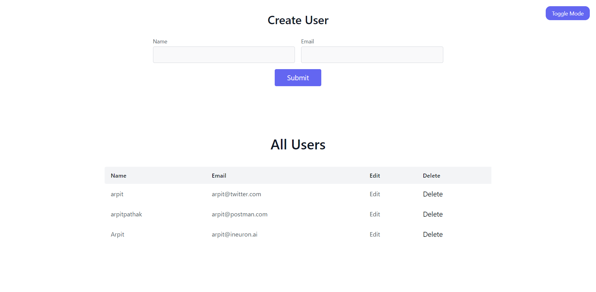
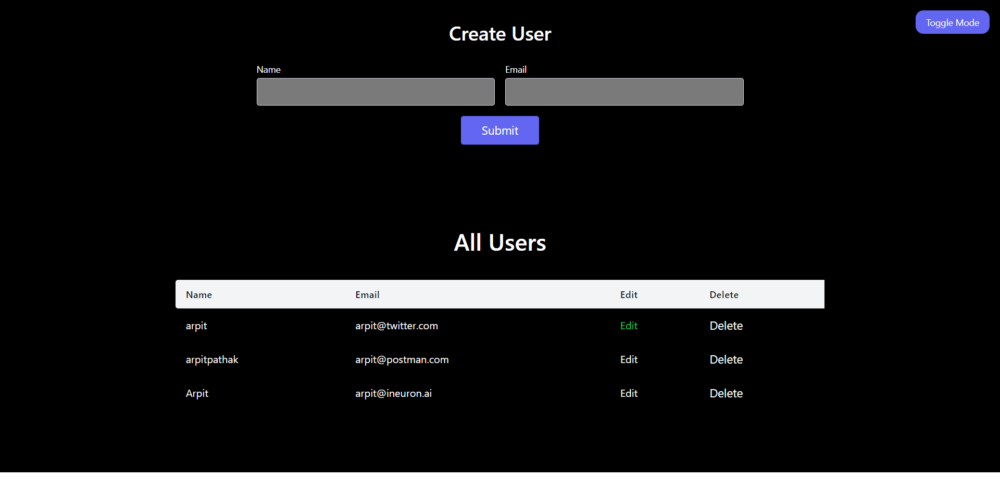

# 🔰 CRUD App 🔰

### This is my first **`MERN`** project that includes CRUD functionality, and we can also toggle dark/light mode with toggle button.

## 📌Tech Stack

### 🔹FrontEnd : React Js, Tailwind CSS

### 🔹Backend : Node Js, Express, Mongoose

### 🔹DataBase : MongoDB

### 📌Screenshots:

---

## 📌 Social Links 📬

